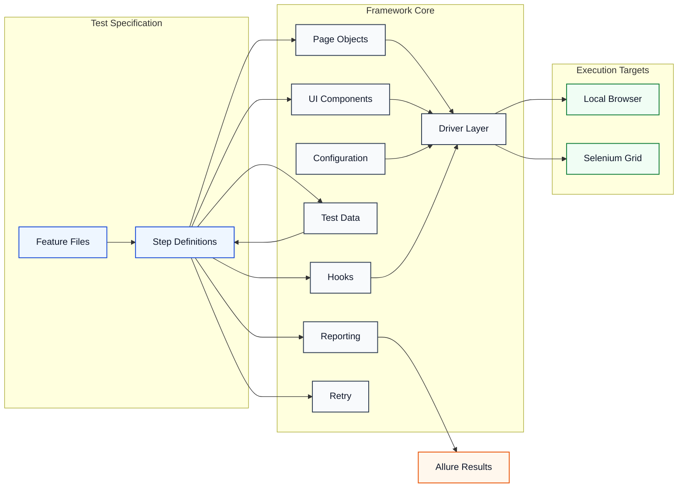
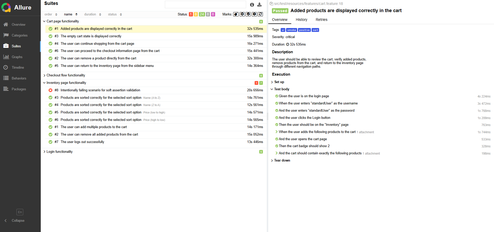

<div align="center">

  <h1>Java Selenium Automation Blueprint</h1>

  <p>
    
    
    
    
    
  </p>

</div>

A practical UI automation blueprint built with Java, Selenium, Cucumber, and TestNG.

This repository is designed as a maintainable and reusable test automation foundation, using Sauce Demo as the sample application under test.

## What It Includes

- Java 21 and Maven-based UI automation framework
- Local and Selenium Grid execution for Chrome, Firefox, and Edge
- Cucumber + TestNG support for BDD, tag filtering, and parallel runs
- `ThreadLocal WebDriver` management per test thread
- Page Object Model and reusable UI component structure
- Flexible configuration via `.env`, system properties, and environment variables
- JSON-backed test data with secret placeholder resolution and `DataFaker` support
- Allure reporting, screenshots on failure, logging, and soft assertions
- Retry support for unstable test runs
- Starter CI/CD assets for GitHub Actions and Jenkins

## Visual Overview



## Tech Stack

- Java 21
- Maven
- Selenium 4
- TestNG
- Cucumber 7
- AssertJ
- Allure
- Log4j2
- Owner
- DataFaker
- Jackson

## Requirements

To run the project locally:

- JDK 21
- Maven
- Chrome, Firefox, or Edge

To run against Selenium Grid:

- Docker
- Docker Compose

## Quick Start

### 1. Clone the repository

```bash
git clone https://github.com/Jeihunn/java-selenium-automation-blueprint.git
cd java-selenium-automation-blueprint
```

### 2. Prepare `.env`

Create a root-level `.env` file based on `.env.example`.

### 3. Run the test suite

```bash
mvn clean test
```

## Useful Commands

Run the full suite:

```bash
mvn clean test
```

Run smoke tests only:

```bash
mvn clean test -Dcucumber.filter.tags="@smoke"
```

Run locally with headed Chrome:

```bash
mvn clean test -Dexecution.mode=local -Dbrowser=chrome -Dbrowser.headless=false
```

Run on Selenium Grid:

```bash
mvn clean test -Dexecution.mode=grid -Dbrowser=chrome
```

Change parallel thread count:

```bash
mvn clean test -Ddataproviderthreadcount=4
```

Skip the intentional framework validation scenario:

```bash
mvn clean test -Dcucumber.filter.tags="not @framework_test"
```

## Project Structure

```text
java-selenium-automation-blueprint
├── .github/                             # GitHub Actions workflow
├── grid/                                # Selenium Grid setup
├── jenkins/                             # Jenkins pipeline assets
├── src/
│   ├── main/java/io/github/jeihunn/
│   │   ├── config/                      # Framework configuration
│   │   ├── driver/                      # Driver setup and execution mode management
│   │   ├── ui/                          # Pages, components, and navigation helpers
│   │   └── utils/                       # Shared utilities
│   └── test/
│       ├── java/io/github/jeihunn/
│       │   ├── assertions/              # Reporting-aware soft assertions
│       │   ├── context/                 # Scenario context storage
│       │   ├── data/                    # Test data loaders, models, and generators
│       │   ├── hooks/                   # Cucumber lifecycle hooks
│       │   ├── reporting/               # Allure-related helpers
│       │   ├── retry/                   # TestNG retry support
│       │   ├── runners/                 # Test runners
│       │   └── steps/                   # Step definitions
│       └── resources/
│           ├── features/                # Gherkin feature files
│           ├── testdata/                # JSON test data
│           ├── allure.properties        # Allure config
│           ├── config.properties        # Runtime config
│           ├── log4j2.xml               # Logging configuration
│           └── testng.xml               # TestNG suite
├── .env.example                         # Example environment variables
└── pom.xml                              # Maven build configuration
```

## Configuration

Default runtime configuration lives in `src/test/resources/config.properties`.

The framework resolves properties in this order:

1. JVM system properties
2. OS environment variables
3. `.env`
4. `config-${env}.properties`
5. `config.properties`

This makes it easy to keep the same framework structure across local, shared, and CI environments.

## Test Data

Test data comes from two main sources:

- JSON files under `src/test/resources/testdata/`
- Runtime-generated values from `DataFaker`

Secret placeholders inside JSON are supported:

```json
{
  "standardUser": {
    "username": "standard_user",
    "password": "${STANDARD_USER_PASSWORD}"
  }
}
```

## Infrastructure Docs

- [`grid/README.md`](grid/README.md) for Selenium Grid setup
- [`jenkins/README.md`](jenkins/README.md) for Jenkins setup
- [`.github/workflows/ci.yml`](.github/workflows/ci.yml) for GitHub Actions CI

## Report Preview

Review the Allure test report here:

[Live Allure Report](http://jeihunn.github.io/java-selenium-automation-blueprint/)



## Notes

- This repository is a blueprint, not a product-specific automation framework.
- The tests run against an external demo application, so upstream UI changes may affect results.
- `@framework_test` is reserved for validating framework behavior.
- `cloud` exists as a configuration value, but Cloud execution is not implemented yet.

## License

This project is licensed under the MIT License. See [LICENSE](LICENSE) for details.
